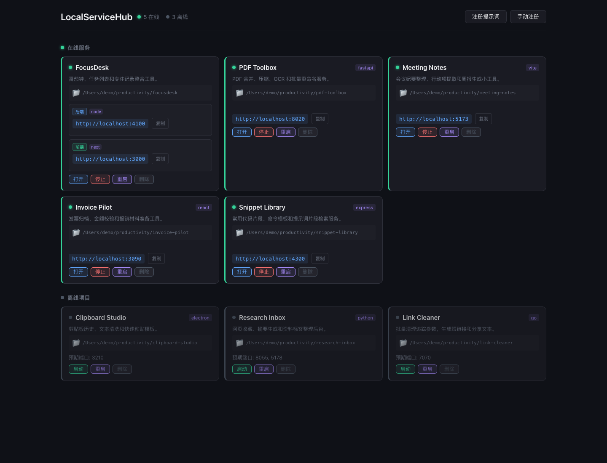

# LocalServiceHub

本地开发服务管理面板。它把散落在终端里的本地项目集中到一个页面里，统一查看在线状态、访问地址、启动命令和常用操作，适合同时维护多个前端、后端、脚本服务或 AI 小工具项目。



## 为什么需要它

本地开发时经常会遇到这些问题：项目开了很多个终端、端口号记不住、某个服务是否还活着不直观、前后端分离项目启动步骤容易忘、换到另一个项目后还要重新翻 README。

LocalServiceHub 的目标很简单：把这些本地服务变成一组可见、可操作、可复用的项目卡片。

## 亮点

- **统一服务面板**：自动扫描本机端口，区分在线项目和离线项目，直接展示可访问链接。
- **一键生命周期管理**：已注册项目可以在面板里启动、停止、重启，不必反复切换终端。
- **支持前后端分离项目**：一个项目可以配置多个启动命令和多个监听端口，例如后端 API + 前端 Vite。
- **AI 辅助注册**：复制内置注册提示词到项目对话中，让 AI 分析项目结构并调用接口完成注册。
- **结构化启动命令**：启动命令拆成 `cmd`、`args`、`cwd`，避免把整条 shell 命令塞进字符串，后续管理更稳定。
- **更清晰的安全边界**：默认拒绝 `bash`、`sh`、`zsh`、`fish`、`osascript` 这类 shell 包装命令；复杂逻辑建议放到项目内脚本再注册。
- **进程托管更稳**：Hub 启动的服务会脱离 Hub 自身的标准输出管道，并写入日志文件，Hub 重启或停止时不会因为管道关闭而连带挂掉子服务。
- **实时状态刷新**：后端通过 `lsof` 扫描端口，并用 WebSocket 推送状态变化，页面无需手动刷新。

## 技术栈

- 后端：Node.js、Express、WebSocket (`ws`)
- 前端：React 19、Vite 8
- 端口扫描：`lsof`
- 进程管理：Node.js `child_process`

## 快速开始

```bash
git clone https://github.com/guchang/localservices.git
cd localservices
npm install
cd web && npm install && cd ..
npm run build
npm start
```

启动后访问：

```text
http://localhost:9900
```

开发模式：

```bash
npm run dev:all
```

## 注册项目

有两种方式：

- 点击页面里的「手动注册」，直接填写项目目录、端口和启动命令。
- 点击「注册提示词」，复制提示词到目标项目的 AI 对话中，让 AI 分析项目并调用注册接口。

推荐使用结构化启动命令。单服务项目可以写成对象：

```json
{
  "cmd": "npm",
  "args": ["run", "dev"],
  "cwd": "/path/to/project"
}
```

前后端分离项目可以写成数组：

```json
[
  {
    "cmd": "python3",
    "args": ["-m", "uvicorn", "main:app", "--port", "8000"],
    "cwd": "/path/to/project/backend"
  },
  {
    "cmd": "npm",
    "args": ["run", "dev"],
    "cwd": "/path/to/project/frontend"
  }
]
```

如果启动逻辑比较复杂，建议放到项目内脚本中：

```json
{
  "cmd": "./scripts/start-backend.sh",
  "args": [],
  "cwd": "/path/to/project"
}
```

Python 虚拟环境也可以直接使用项目内 `.venv/bin/python` 的绝对路径。

完整注册示例：

```bash
curl -X POST http://localhost:9900/api/projects/register \
  -H 'Content-Type: application/json' \
  -d '{
    "name": "my-project",
    "description": "我的本地开发项目",
    "projectDir": "/path/to/project",
    "startCommand": [
      {"cmd":"python3","args":["-m","uvicorn","main:app","--port","8000"],"cwd":"/path/to/project/backend"},
      {"cmd":"npm","args":["run","dev"],"cwd":"/path/to/project/frontend"}
    ],
    "ports": [8000, 3000]
  }'
```

注册后可以调用下面两个接口确认结果：

```bash
curl http://localhost:9900/api/projects
curl http://localhost:9900/api/services
```

## 常用命令

| 命令 | 说明 |
| --- | --- |
| `npm start` | 启动生产模式服务 |
| `npm run dev` | 只启动后端，并启用 Node watch |
| `npm run dev:web` | 只启动前端 Vite 开发服务 |
| `npm run dev:all` | 同时启动前后端开发模式 |
| `npm run build` | 构建前端并复制到 `public/` |

## 环境变量

| 变量 | 默认值 | 说明 |
| --- | --- | --- |
| `PORT` | `9900` | Hub 服务端口 |
| `SCAN_INTERVAL` | `5000` | 端口扫描间隔，单位毫秒 |

## API

| 方法 | 路径 | 说明 |
| --- | --- | --- |
| `GET` | `/api/services` | 获取所有服务状态 |
| `GET` | `/api/services/online` | 获取在线服务 |
| `GET` | `/api/projects` | 获取所有已注册项目 |
| `POST` | `/api/projects` | 添加项目 |
| `POST` | `/api/projects/register` | 注册项目并刷新服务状态 |
| `PATCH` | `/api/projects/:id` | 更新项目 |
| `DELETE` | `/api/projects/:id` | 删除项目 |
| `POST` | `/api/services/:id/start` | 启动服务 |
| `POST` | `/api/services/:id/stop` | 停止服务 |
| `POST` | `/api/services/:id/restart` | 重启服务 |

## License

MIT
